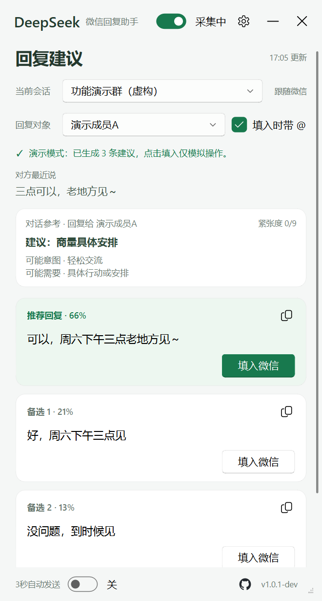
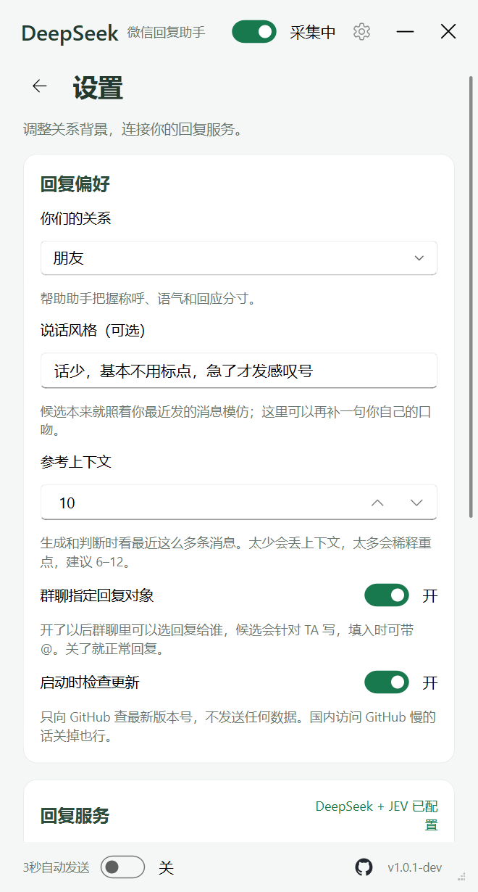
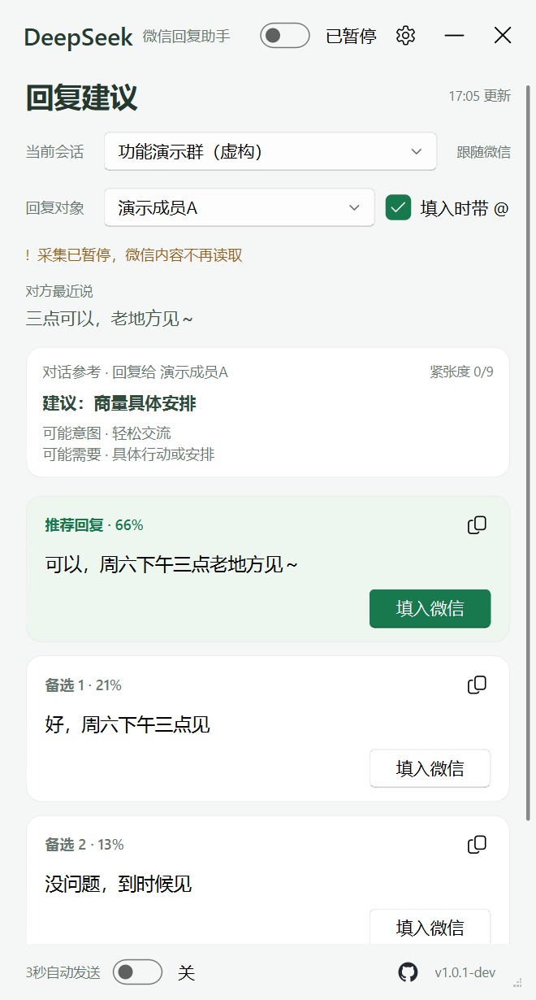

# DeepSeek + TypeSafe JEV 微信回复助手

这是一个微信桌面端回复辅助工具：在本机识别当前聊天画面，使用 DeepSeek 官方接口生成三条候选话术，并可选接入 TypeSafe 官方 JEV 做结构化判断、质量复审和候选排序。**Windows 是现有使用版本；macOS Apple Silicon 版是预览构建，尚未通过真实 Mac 微信的读取与填入验收，不能视为稳定版。**

本仓库是基于 [jev-chat/jev-chat-windows](https://github.com/jev-chat/jev-chat-windows) 的公开二次开发版本，不是该项目的官方发行版。我们保留了本地 OCR 和悬浮窗等基础能力，重新实现了模型调用链、自动发送门禁、版本更新和当前界面，并新增 macOS 窗口采集与手动填入适配。详细来源与改动边界见 [NOTICE.md](NOTICE.md)。

## 这个版本做了什么

与上游 Windows 项目相比，本仓库的主要变化是：

| 项目 | 本仓库实现 |
| --- | --- |
| 候选话术 | 只使用 DeepSeek 官方 API，不需要 OpenRouter |
| JEV 判断 | 直接调用 TypeSafe 官方 `POST /v1/systemone` |
| 生成流程 | JEV 预判 → DeepSeek 生成 → JEV 复审排序 |
| 不合格处理 | 全部候选不合格时重写一次；再次不通过则禁止自动发送 |
| 判断卡片 | 显示危险度、真实意图与把握度、对方需要、建议行动等信息 |
| 自动发送 | Windows 主界面独立开关；默认关闭，开启后倒计时 3 秒，可随时取消；Mac 预览版禁用 |
| 版本管理 | 显示正式版本号，启动时可检查本仓库 GitHub Release |

TypeSafe 没有负责写回复。它输出结构化判断和概率；真正的中文候选话术由 DeepSeek 生成。

## 下载与启动

Windows 稳定版前往 [最新正式版](https://github.com/Aimark-dai/jev-chat-windows-deepseek-jev/releases/latest) 下载 `jev-chat-windows-vX.Y.Z.zip`。macOS Apple Silicon 预览版前往 [v1.0.4 预览发布页](https://github.com/Aimark-dai/jev-chat-windows-deepseek-jev/releases/tag/v1.0.4) 下载 `jev-chat-macos-arm64-v1.0.4.zip`；Intel Mac 暂无包。

1. Windows 完整解压 ZIP，运行其中的 `jev-chat-windows.exe`，不能只单独拿出 EXE。Mac 解压后把 `JevChat.app` 拖到“应用程序”，从 Finder 打开。
2. Mac 首次运行需要在系统设置中允许“屏幕录制”和“辅助功能”；授权后重新打开应用。预览包尚未签名和公证，macOS 可能要求在系统设置的“隐私与安全性”中确认打开；不要全局关闭 Gatekeeper。
3. 第一次启动时填写 [DeepSeek API Key](https://platform.deepseek.com/)。
4. 如需 JEV 全链路判断，再开启对应开关并填写 TypeSafe API Key。
5. 保持微信聊天窗口可见且不要最小化。Mac 版只建议先测试识别、生成和人工确认后的填入，**不要依赖它发送重要消息**。

系统要求：Windows 10 1903+ 或 Windows 11 搭配 Windows 微信 4.x；Mac 预览包仅适用于 Apple Silicon 与 macOS 15+。两平台均需桌面版微信。

程序当前没有数字签名。如果 SmartScreen 拦截，可选择“更多信息”→“仍要运行”，也可以按照后文说明自行打包。

## 日常使用

1. 在微信中打开要回复的单聊或群聊。
2. 对方出现新消息后，软件读取最近聊天并生成三条候选。
3. 先查看 JEV 判断和候选内容，再点击“填入微信”或复制按钮。
4. 默认由你自己确认并发送。

Windows 版如果在主界面打开“3秒自动发送”，软件会先把推荐候选填入微信输入框，再显示倒计时。倒计时期间切换会话、收到新消息、关闭开关或微信失去前台状态，都会取消发送。JEV 复审没有通过时也不会自动发送。Mac 预览版强制关闭自动发送。

## 处理流程

```text
Windows Graphics Capture / macOS CoreGraphics 读取当前微信窗口
  → RapidOCR 在本机识别会话名、发言人和聊天内容
  → TypeSafe JEV 判断真实意图、风险、需要和建议行动（可选）
  → DeepSeek 根据聊天上下文与 JEV 判断生成三条候选
  → TypeSafe JEV 复审质量并给候选排序（可选）
  → 不合格时最多重写一次
  → 在悬浮窗展示，由用户填入或在明确开启后倒计时发送
```

关闭 TypeSafe JEV 后，DeepSeek 仍会生成候选，并承担基础判断和排序。

## 界面

以下图片全部使用虚构会话和虚构成员，不包含真实聊天数据。

<table>
<tr>
<td width="33%"></td>
<td width="33%"></td>
<td width="33%"></td>
</tr>
<tr>
<td align="center">JEV 判断、三条候选与群聊回复对象</td>
<td align="center">DeepSeek、TypeSafe、关系与上下文设置</td>
<td align="center">暂停读取微信，保留已有候选</td>
</tr>
</table>

## 主要功能

- 本地 OCR 跟随微信当前会话，不读取微信数据库。
- 单聊、群聊分别保存临时上下文，群聊可指定回复对象。
- DeepSeek 生成三条不同长度和语气的候选。
- TypeSafe JEV 可判断危险度、真实意图、对方需要、建议行动以及是否适合给出实质内容。
- JEV 对生成结果进行质量门禁，并用选择概率给候选排序。
- 候选支持复制或填入微信；填入不等于发送。
- Windows 3 秒自动发送默认关闭，并有会话、前台状态和复审结果门禁；Mac 预览版不可开启。
- 支持暂停采集、调整上下文数量、自定义关系和说话风格；同一会话中收集到你自己最近 6–12 条有效短消息后，会把这些消息作为口吻样本交给 DeepSeek。
- 启动时可检查 GitHub 新版本，点击提示前往 Release 页面下载。

## 设置与密钥

| 设置 | 用途 | 保存位置 |
| --- | --- | --- |
| DeepSeek API Key | 生成候选；关闭 TypeSafe 时也负责基础判断 | Windows 用户环境变量；Mac 钥匙串 |
| TypeSafe API Key | JEV 预判、复审和排序 | Windows 用户环境变量；Mac 钥匙串 |
| TypeSafe JEV 全链路优化 | 在生成前后调用 JEV | `config.json` |
| 关系与说话风格 | 控制称呼、语气和分寸 | `config.json` |
| 参考上下文 | 每次处理最近 3–30 条消息 | `config.json` |
| 群聊回复对象 | 让候选针对指定成员生成 | `config.json` |
| 3 秒自动发送 | Windows 明确开启后才允许倒计时发送；Mac 预览版禁用 | `config.json`，默认关闭 |
| 启动时检查更新 | 查询本仓库最新 Release | `config.json`，默认开启 |

API Key 不写入 `config.json`、日志或发布包。已配置时设置页留空保存，会继续保留原有 Key。
Windows 的 `config.json` 位于程序目录；Mac 位于 `~/Library/Application Support/JevChat/config.json`。

## 隐私和安全边界

- 仅用于读取你自己设备上、你有权查看的聊天内容。
- 采集方式是微信窗口截图与本地 OCR；不注入微信、不解密数据库、不读取进程内存。
- 截图帧在内存中处理，不作为聊天图片保存。
- 调用 DeepSeek 或 TypeSafe 时，会发送你设置数量内的最近聊天、关系信息、说话风格和必要的群聊回复对象。
- 打开版本检查时只查询本仓库 GitHub Release，不附带聊天内容。
- 自动发送默认关闭，Mac 预览版强制禁用；涉及转账、红包、收款的内容被起草规则明确禁止。
- AI 判断和候选都可能出错，发送前应当人工确认。

## 模型与接口

| 环节 | 服务 | 当前模型/别名 |
| --- | --- | --- |
| 候选生成 | DeepSeek 官方 Chat Completions | `deepseek-flash` |
| JEV 预判 | TypeSafe System One | `jev-latest` |
| JEV 复审与排序 | TypeSafe System One | `jev-latest` |

DeepSeek 使用的接口可参考 [Chat Completions](https://api-docs.deepseek.com/api/create-chat-completion/)、[JSON Output](https://api-docs.deepseek.com/guides/json_mode/) 和 [Thinking Mode](https://api-docs.deepseek.com/guides/thinking_mode/)。TypeSafe 使用其官方 `/v1/systemone` 接口。

## 从源码运行

```powershell
git clone https://github.com/Aimark-dai/jev-chat-windows-deepseek-jev.git
cd jev-chat-windows-deepseek-jev
python -m venv .venv
.venv\Scripts\Activate.ps1
pip install -r requirements.txt
python main.py
```

自行打包：

```powershell
pip install pyinstaller
pyinstaller --noconfirm --clean jev.spec
```

也可以直接运行 `build.bat`。成品位于 `dist\jev-chat-windows\`，必须保留整个文件夹。

Mac 源码运行使用系统 Python 3.11+，在终端运行 `python3 -m venv .venv && source .venv/bin/activate && pip install -r requirements.txt && python main.py`。Mac 上运行同一个 `pyinstaller --noconfirm --clean jev.spec` 命令会生成 `dist/JevChat.app`；不能在 Windows 上交叉打包 Mac 程序。

## 项目目录

```text
app/            界面、微信窗口采集、OCR、填入与发送门禁
core/           DeepSeek 起草、TypeSafe/DeepSeek 判断与完整编排
probe/          Windows 微信采集与 OCR 的验证脚本
tools/          UI 预览、图标和端到端演示工具
tests/          判断、生成、更新和安全门禁测试
docs/           项目约束、图标和虚构演示截图
```

## 当前限制

- 微信最小化后不会继续渲染，必须保持窗口非最小化。Mac 预览版要求窗口可见；窗口被遮挡、多屏幕或 Retina 缩放场景尚未实机验收。
- OCR 可能认错会话名、成员名或聊天文字，界面中的聊天记录可用于核对。
- 群聊多人连续发言比单聊更容易产生判断偏差。
- “填入时带 @”写入的是普通文本，不会触发微信原生的成员提醒。
- 当前更新功能负责发现新版本并打开 Release 页面，不会静默覆盖安装。
- Mac 预览版未签名、未公证，且尚未在真实 Mac 微信中完成 OCR、填入和权限全流程验收；CI 构建和启动检查不能替代实机验收。

## 本仓库版本记录

| 版本 | 日期 | 本仓库新增内容 |
| --- | --- | --- |
| [v1.0.4 预览版](https://github.com/Aimark-dai/jev-chat-windows-deepseek-jev/releases/tag/v1.0.4) | 2026-09-23 | 新增 Apple Silicon Mac 构建与权限适配；修复 Windows 打包 QtCore 缺失、群聊回复对象及 TypeSafe 拒绝访问提示。Mac 实机交互仍待验收 |
| [v1.0.3](https://github.com/Aimark-dai/jev-chat-windows-deepseek-jev/releases/tag/v1.0.3) | 2026-09-22 | TypeSafe 判断字段与聊天风格学习；重写本仓库介绍及版本记录 |
| [v1.0.2](https://github.com/Aimark-dai/jev-chat-windows-deepseek-jev/releases/tag/v1.0.2) | 2026-09-22 | JEV 判断卡片补充危险度、真实意图把握度、对方需要、建议行动和紧张缓解状态 |
| [v1.0.1](https://github.com/Aimark-dai/jev-chat-windows-deepseek-jev/releases/tag/v1.0.1) | 2026-09-22 | 建立 JEV 预判、DeepSeek 生成、JEV 复审排序与限次重写链路；完善版本检查 |
| [v1.0.0](https://github.com/Aimark-dai/jev-chat-windows-deepseek-jev/releases/tag/v1.0.0) | 2026-09-22 | 首次公开本定制版：DeepSeek 官方生成、TypeSafe 官方 JEV、3 秒自动发送门禁 |

完整变更见 [CHANGELOG.md](CHANGELOG.md)。上游项目的 `v0.1.x` 记录属于上游，不作为本仓库版本历史。

## 来源与许可

本仓库包含基于 MIT 项目继续修改的代码：

- [jev-chat/jev-chat-windows](https://github.com/jev-chat/jev-chat-windows)：Windows 截图、OCR、悬浮窗等基础实现。
- [Finderchangchang/jev-chat-JARVIS](https://github.com/Finderchangchang/jev-chat-JARVIS)：更早的移动端项目和 JEV 判断思路来源。
- [RapidOCR](https://github.com/RapidAI/RapidOCR)、[windows-capture](https://github.com/NiiightmareXD/windows-capture)、[PyQt-Fluent-Widgets](https://github.com/zhiyiYo/PyQt-Fluent-Widgets)：运行依赖或界面组件。

上游作者没有参与或背书本仓库的定制改动。详细说明见 [NOTICE.md](NOTICE.md)，许可条款见 [LICENSE](LICENSE)。
